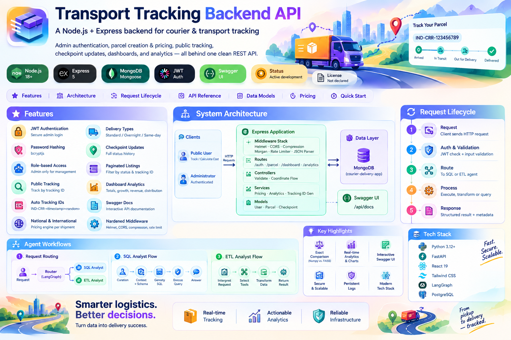
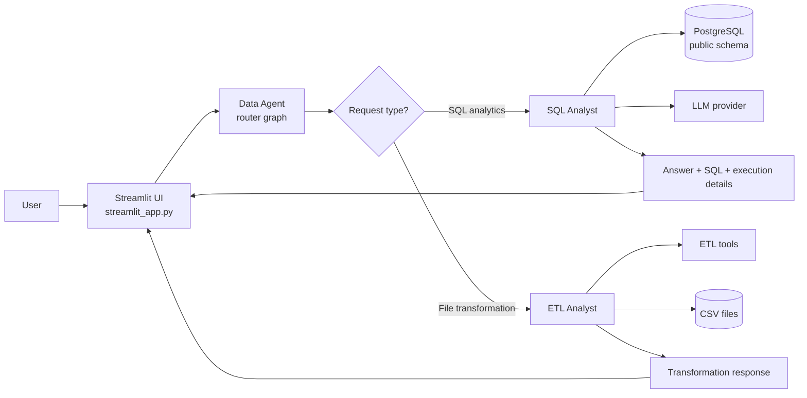
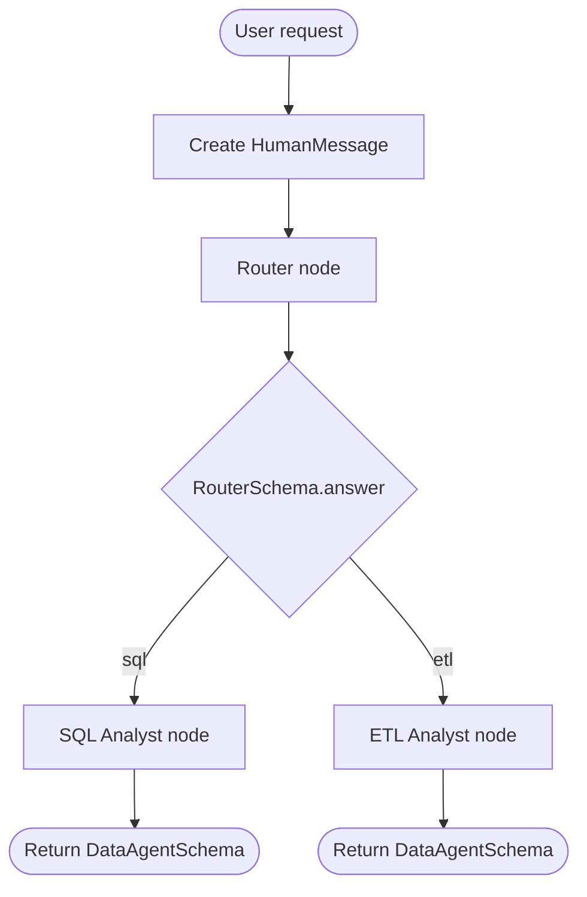
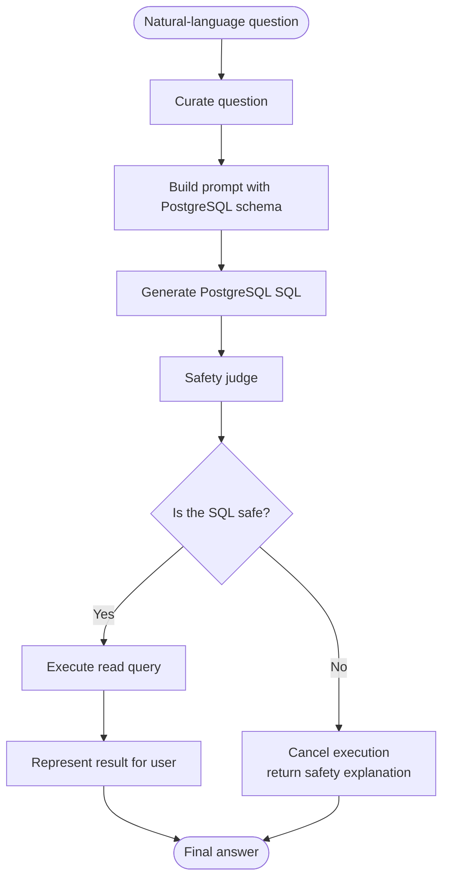
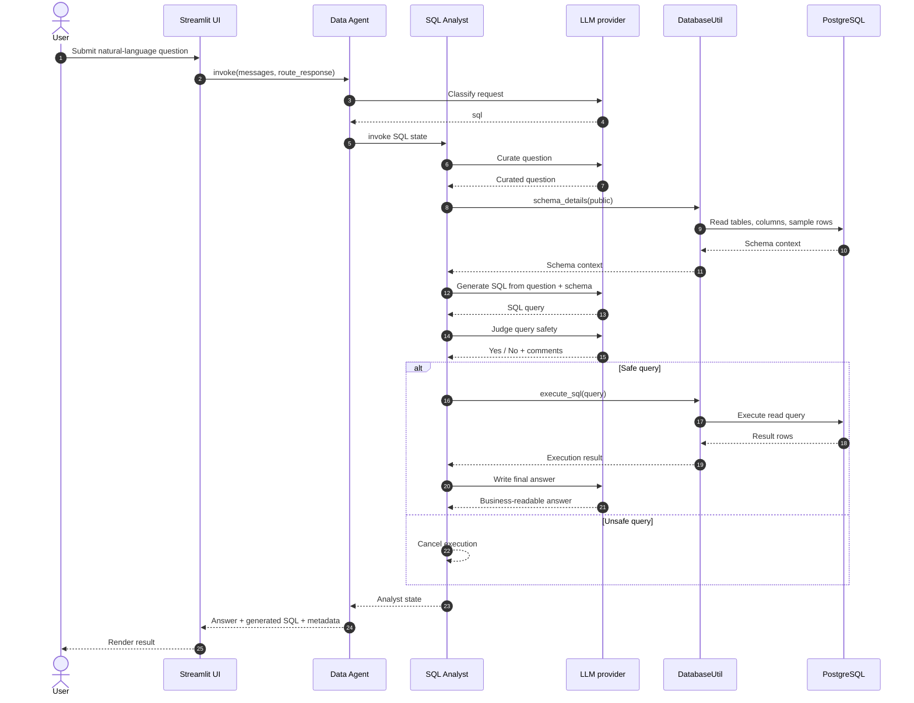
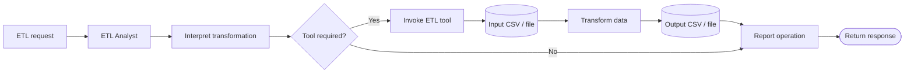
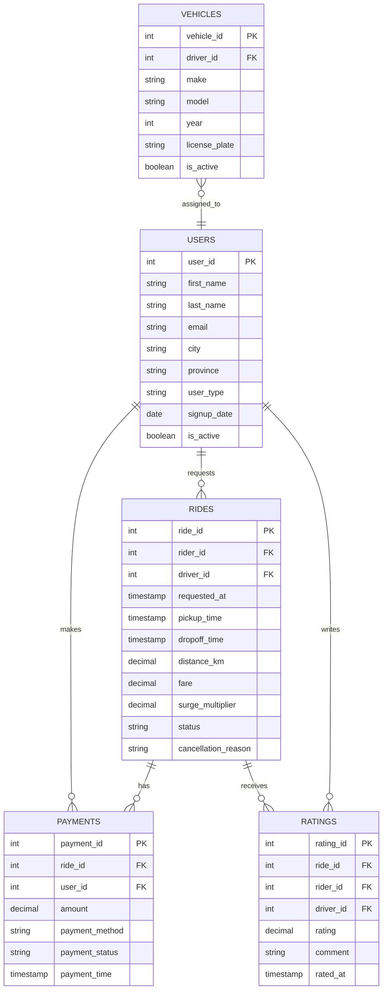
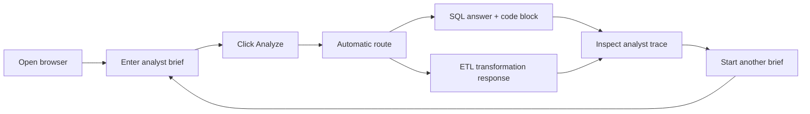
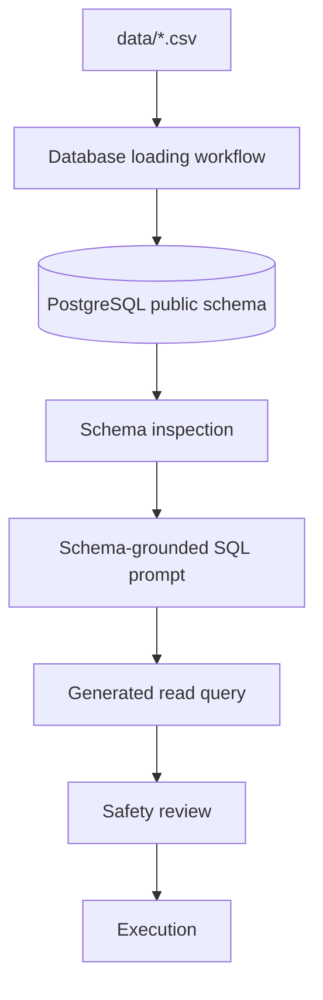

<div align="center">

# 🚕 OLA MASRAG Data Agent

### Multi-Agent Analytics Workspace for Ride-Hailing Data

*Ask a question in plain English. Get SQL insights or a completed ETL job — automatically routed to the right specialist agent.*

[](https://www.python.org/)
[](https://streamlit.io/)
[](https://langchain-ai.github.io/langgraph/)
[](https://www.postgresql.org/)
[](#)
[](https://github.com/paras160500/OLA-Data-Agent---MASRAG-Agentic-AI)

</div>



---

## ✨ Overview

**OLA MASRAG Data Agent** is an agentic data assistant built for ride-hailing analytics. Type a request into the Streamlit UI, and a router agent classifies it and hands it off to the right specialist:

- 🧮 **SQL Analyst** — turns business questions into schema-aware, safety-checked SQL and readable answers
- 🛠️ **ETL Analyst** — handles file transformations and data-prep work using a tool-calling agent

No SQL required. No manual coordination between steps. Just describe what you need.

> 💡 **Example:** *"Find the top five drivers by revenue from completed rides in 2026"* → routed to the **SQL Analyst**
> *"Filter `data/rides.csv` to completed rides and save a new CSV"* → routed to the **ETL Analyst**

---

## 🧭 What the project does

| Request type | Responsible agent | Typical output |
|---|---|---|
| 📊 Business questions over relational data | **SQL Analyst** | Natural-language answer + generated SQL + execution details |
| 🗂️ File transformations & data preparation | **ETL Analyst** | Tool-driven transformation response + output file |

The routing decision is made entirely by an LLM-backed classifier — the user never has to pick an agent manually.

---

## 🌟 Highlights

| | |
|---|---|
| 🗣️ **Natural-language analytics** | Ask operational questions without writing a line of SQL |
| 🧠 **Multi-agent orchestration** | A dedicated router sends each request to the right specialist |
| 🔍 **Schema-aware SQL generation** | Inspects live PostgreSQL tables, columns, types & sample rows before generating queries |
| 🛡️ **SQL safety gate** | Every generated query is reviewed before execution; unsafe requests are cancelled |
| 📝 **Human-readable answers** | Query results are summarized into concise, business-friendly language |
| 🔧 **ETL tool routing** | File-transformation requests are handled by a separate tool-using analyst |
| 🖥️ **Interactive Streamlit workspace** | Full visibility into the route taken, generated SQL, execution output, and safety review |
| 📁 **Local-first data layout** | Ships with realistic OLA-style CSVs for users, vehicles, rides, payments & ratings |

---

## 🏗️ Architecture



### Component responsibilities

| Component | Location | Responsibility |
|---|---|---|
| 🖥️ Streamlit UI | `streamlit_app.py` | Provides the user-facing analytics workspace |
| 🧭 Data Agent | `agents/data_agent.py` | Classifies the request and selects the specialist graph |
| 🧮 SQL Analyst | `agents/sql_analyst.py` | Curates questions, generates SQL, judges safety, executes queries, writes answers |
| 🛠️ ETL Analyst | `agents/etl_analyst.py` | Interprets transformation requests and invokes ETL tools |
| 🗄️ Database utility | `utils/database.py` | Connects to PostgreSQL, inspects schema metadata, executes SQL |
| 🔧 ETL tools | `utils/etl_tools.py` | Supplies file and transformation operations to the ETL graph |
| 🤖 LLM selector | `utils/llm_pick.py` | Selects the configured model by task complexity |
| 📦 State models | `models/schema.py` | Defines the Pydantic state passed through the graphs |

---

## 🔄 Agent workflows

<details>
<summary><strong>1️⃣ Request routing workflow</strong></summary>

Every request enters the Data Agent as a `HumanMessage`. The router classifies it as either `sql` or `etl`, then sends it to the corresponding graph.



</details>

<details>
<summary><strong>2️⃣ SQL Analyst workflow</strong></summary>

The SQL path separates question refinement, context construction, SQL generation, safety review, execution, and final answer generation.



</details>

<details>
<summary><strong>3️⃣ SQL request sequence</strong></summary>



</details>

<details>
<summary><strong>4️⃣ ETL workflow</strong></summary>

The ETL Analyst is implemented as a tool-using graph. The LLM decides when a transformation tool is needed, the tool executes the operation, and the graph returns the result to the UI.



</details>

---

## 🗃️ Data model

The included datasets represent a normalized ride-hailing domain. The database-loading workflow creates corresponding PostgreSQL tables in the `public` schema.



### Included source files

| File | Domain |
|---|---|
| `data/users.csv` | Rider and driver user records |
| `data/vehicles.csv` | Driver vehicle records |
| `data/rides.csv` | Ride lifecycle, fare, distance, and status |
| `data/payments.csv` | Ride payments and transaction status |
| `data/ratings.csv` | Ride ratings and comments |

---

## 📂 Repository structure

```
OLA-Data-Agent---MASRAG-Agentic-AI/
├── agents/
│   ├── data_agent.py          # Router graph
│   ├── etl_analyst.py         # ETL specialist graph
│   ├── sql_analyst.py         # SQL specialist graph
│   └── scratch.py             # Development scratchpad
├── data/
│   ├── payments.csv
│   ├── ratings.csv
│   ├── rides.csv
│   ├── users.csv
│   └── vehicles.csv
├── models/
│   └── schema.py              # Pydantic graph states
├── utils/
│   ├── database.py            # PostgreSQL access and schema inspection
│   ├── etl_tools.py           # ETL tools
│   ├── feed_db.py             # Database loading script
│   └── llm_pick.py            # LLM selection
├── streamlit_app.py           # User-facing application
├── main.py                    # Existing backend/database entry point
├── requirements-streamlit.txt # Runtime dependencies for the UI
├── pyproject.toml
└── README.md
```

---

## 🚀 Getting started

### Prerequisites

| Requirement | Recommended version | Purpose |
|---|---|---|
| 🐍 Python | 3.12+ | Application runtime |
| 🐘 PostgreSQL | 14+ | SQL Analyst database |
| 🔑 OpenAI-compatible API access | Configured key | Routing, SQL generation, judging, and answer generation |
| 🌳 Git | Current stable release | Repository management |

### 1. Clone the repository

```bash
git clone https://github.com/paras160500/OLA-Data-Agent---MASRAG-Agentic-AI.git
cd OLA-Data-Agent---MASRAG-Agentic-AI
```

### 2. Create and activate a virtual environment

```bash
python -m venv .venv

# macOS / Linux
source .venv/bin/activate

# Windows PowerShell
.venv\Scripts\Activate.ps1
```

### 3. Install dependencies

```bash
python -m pip install --upgrade pip
python -m pip install -r requirements-streamlit.txt
```

### 4. Configure the model API key

Create a `.env` file in the repository root:

```env
OPENAI_API=your_api_key_here
```

> The application also accepts `OPENAI_API_KEY` as an environment variable and maps it to the repository's `OPENAI_API` convention when necessary.

### 5. Prepare PostgreSQL

Create a PostgreSQL database and load the included CSVs using the project's database-loading workflow. The SQL Analyst and database utility currently target a local PostgreSQL instance using the `postgres` database and `public` schema.

Before running the app, verify connection settings in:

```
agents/sql_analyst.py
utils/database.py
```

---

## ▶️ Running the application

```bash
streamlit run streamlit_app.py
```

The interface provides:

- ✅ A natural-language request form
- ✅ Automatic SQL-versus-ETL routing
- ✅ A formatted answer area
- ✅ A visible generated SQL code block for SQL requests
- ✅ An expandable analyst trace with execution results and safety comments
- ✅ Starter prompts for common OLA analytics tasks



---

## 💬 Example prompts

### 📊 SQL analytics

```text
For rides requested in 2026, find the top 5 drivers by total revenue from
completed rides. Show driver ID, completed rides, total revenue, average
fare, average rating, total distance, and cancellation rate.
```

```text
How many completed rides were requested in 2026?
```

```text
What are the average fares by city and user type?
```

### 🛠️ ETL operations

```text
Transform data/payments.csv and save the result as a CSV.
```

```text
Filter data/rides.csv to completed rides and save the transformed file
in the output folder.
```

> 💡 **Tip:** For best results, include the input path, transformation rule, desired output location, and output format.

---

## ⚙️ Configuration

### Model selection

`utils/llm_pick.py` maps task levels to configured model names:

| Level | Intended use |
|---|---|
| `low` | Question curation and final answer writing |
| `medium` | Routing, SQL generation, and SQL safety review |
| `high` | Reserved for higher-complexity tasks |
| `reason` | Reserved for reasoning-oriented tasks |

Adjust these mappings in one place when changing providers or model names.

### Database connection

```python
{
    "host": "localhost",
    "port": 5432,
    "database": "postgres",
    "user": "postgres",
    "password": "<your-password>",
}
```

> ⚠️ For production use, move these values to environment variables or a secrets manager.

---

## 🗄️ Database setup



The schema inspection step matters because it gives the SQL Analyst database-specific context instead of relying only on hard-coded assumptions.

---

## 🔐 Security and operational notes

The SQL Analyst includes an LLM-based safety judge intended to block data-modifying statements such as `INSERT`, `UPDATE`, `DELETE`, `DROP`, `ALTER`, `TRUNCATE`, and `CREATE`. **This is defense-in-depth, not a complete database security boundary.**

For production deployment:

| Area | Recommendation |
|---|---|
| 🔑 Database permissions | Use a dedicated read-only database role for analytics |
| 🔒 Secrets | Store API and database credentials in environment variables or a secrets manager |
| ✅ SQL validation | Add deterministic SQL parsing and an explicit read-only transaction policy |
| ⏱️ Query limits | Enforce statement timeouts and result-size limits |
| 📈 Observability | Log route, latency, query status, and errors — never log secrets |
| 🕵️ Data privacy | Mask or restrict PII before exposing it to an LLM |
| 🌐 Production deployment | Place PostgreSQL behind network controls and use TLS where applicable |

> 🚨 **Important:** Do not commit real API keys or database passwords to the repository. The current source contains local-development connection defaults that must be replaced before public or production deployment.

---

## 🧯 Troubleshooting

<details>
<summary><strong>Streamlit cannot import <code>agents</code></strong></summary>

Run Streamlit from the repository root:

```bash
streamlit run streamlit_app.py
```

The application also adds its repository root to `sys.path`, which supports launching it from another working directory.

</details>

<details>
<summary><strong>The application reports a missing API key</strong></summary>

Confirm that `.env` exists in the repository root and contains:

```env
OPENAI_API=your_api_key_here
```

</details>

<details>
<summary><strong>PostgreSQL connection fails</strong></summary>

Confirm that PostgreSQL is running, the database exists, the `public` tables are loaded, and the connection settings in the SQL Analyst match your local environment.

</details>

<details>
<summary><strong>The request is routed incorrectly</strong></summary>

Use explicit language:
- For **SQL**, mention "query", "average", "count", "top drivers", or "SQL"
- For **ETL**, mention "transform", "filter", "clean", "save CSV", or a file path

</details>

<details>
<summary><strong>SQL is cancelled</strong></summary>

Inspect the analyst trace in the Streamlit UI — the safety judge comments explain why the generated query was not executed.

</details>

---

## 🛣️ Roadmap

- [ ] Replace hard-coded database credentials with environment-based configuration
- [ ] Add deterministic SQL parsing and a read-only database role
- [ ] Add automated tests for router decisions, SQL safety, and database utilities
- [ ] Return structured tabular results instead of stringified tuples
- [ ] Add downloadable CSV and JSON exports in the Streamlit interface
- [ ] Add query history and trace identifiers for reproducibility
- [ ] Add data-quality checks before ETL transformations
- [ ] Add containerized deployment with health checks
- [ ] Add evaluation datasets for routing accuracy and SQL correctness

---

## 📚 References

- [Python][1] — official website
- [Streamlit][2] — documentation
- [LangGraph][3] — documentation
- [PostgreSQL][4] — documentation
- [Mermaid][5] — diagramming documentation
- [OLA MASRAG Data Agent][6] — repository

[1]: https://www.python.org/ "Python official website"
[2]: https://docs.streamlit.io/ "Streamlit documentation"
[3]: https://langchain-ai.github.io/langgraph/ "LangGraph documentation"
[4]: https://www.postgresql.org/docs/ "PostgreSQL documentation"
[5]: https://mermaid.js.org/ "Mermaid diagramming documentation"
[6]: https://github.com/paras160500/OLA-Data-Agent---MASRAG-Agentic-AI "OLA MASRAG Data Agent repository"

---

<div align="center">

Made with 🚕 for smarter ride-hailing analytics

</div>
