<div align="center">

# 📦 Transport Tracking Backend API

### A Node.js + Express backend for courier & transport tracking

*Admin authentication, parcel creation & pricing, public tracking, checkpoint updates, dashboards, and analytics — all behind one clean REST API.*

[](https://nodejs.org/)
[](https://expressjs.com/)
[](https://mongoosejs.com/)
[](https://jwt.io/)
[](http://localhost:5000/api/docs)
[](https://github.com/paras160500/Transport-Tracking-Backend-App-NodeJS)
[](#-license)

</div>


> **Project status:** This README documents the current repository implementation. The backend is an API service and does not include a frontend application.

---

## 📖 Contents

- [Features](#-features)
- [Technology stack](#-technology-stack)
- [Architecture](#-architecture)
- [Request lifecycle](#-request-lifecycle)
- [Parcel checkpoint state machine](#-parcel-checkpoint-state-machine)
- [Feature map](#-feature-map)
- [Prerequisites](#-prerequisites)
- [Getting started](#-getting-started)
- [Environment variables](#-environment-variables)
- [Running the API](#-running-the-api)
- [API overview](#-api-overview)
- [Authentication](#-authentication)
- [API reference](#-api-reference)
- [Data models](#-data-models)
- [Pricing rules](#-pricing-rules)
- [Project structure](#-project-structure)
- [Security and operational behavior](#-security-and-operational-behavior)
- [Troubleshooting](#-troubleshooting)
- [Contributing](#-contributing)
- [License](#-license)

---

## ✨ Features

| | |
|---|---|
| 🔐 **JWT-based admin authentication** | Secure, stateless login for administrators |
| 🧂 **Password hashing** | `bcryptjs` hashing before any password touches the database |
| 🛡️ **Role-gated endpoints** | Parcel management and analytics restricted to `admin` accounts |
| 🔎 **Public parcel lookup** | Anyone can track a parcel by tracking ID — no login required |
| 🆔 **Automatic tracking IDs** | Format: `IND-CRR-<timestamp><random-number>` |
| 🌍 **National & international pricing** | Distinct pricing engines per shipment type |
| ⏱️ **Delivery types** | Standard, overnight, and same-day shipments |
| 📍 **Parcel checkpoints** | Full status history per parcel |
| 📄 **Paginated listings** | Filter parcels by status and tracking ID |
| 📊 **Dashboard statistics** | Totals, monthly growth, revenue, status & weight distribution |
| 📈 **Operational analytics** | Revenue trends, top cities, delivery performance, summaries |
| 📚 **Swagger UI** | Interactive docs at `/api/docs` |
| 🧱 **Hardened middleware stack** | Helmet, CORS, compression, Morgan, rate limiting, centralized errors |

---

## 🧰 Technology stack

| Layer | Technology |
|---|---|
| Runtime | Node.js (ECMAScript modules) |
| Web framework | Express 5 |
| Database | MongoDB via Mongoose |
| Authentication | JSON Web Tokens (JWT) |
| Password security | `bcryptjs` |
| Validation | Joi |
| API documentation | Swagger JSDoc + Swagger UI Express |
| Security middleware | Helmet, CORS, cookie-parser |
| Performance & observability | Compression, Morgan, express-rate-limit |

---

## 🏗️ Architecture

The application follows a **layered Express architecture** — requests flow from routes → controllers → services → models, with cross-cutting middleware wrapping the whole stack.

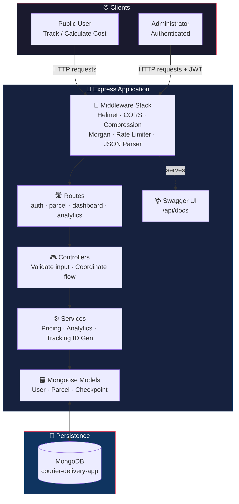

---

## 🔄 Request lifecycle

<details>
<summary><strong>1️⃣ Startup sequence — how the server boots</strong></summary>

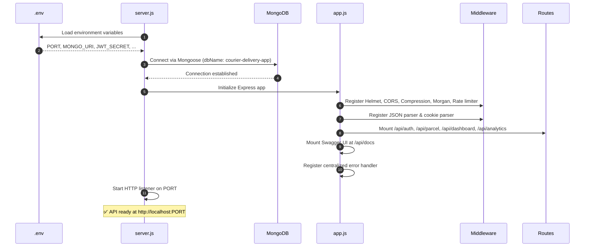

</details>

<details>
<summary><strong>2️⃣ Admin login flow</strong></summary>

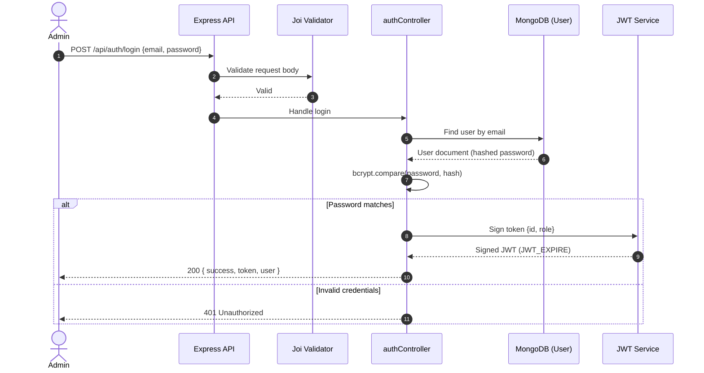

</details>

<details>
<summary><strong>3️⃣ Parcel creation & pricing flow</strong></summary>

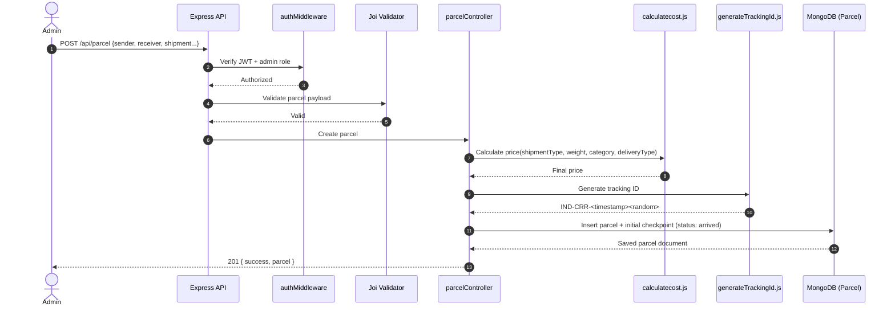

</details>

<details>
<summary><strong>4️⃣ Public parcel tracking flow</strong></summary>

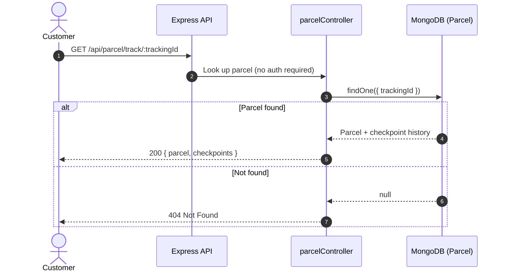

</details>

<details>
<summary><strong>5️⃣ Checkpoint update flow</strong></summary>

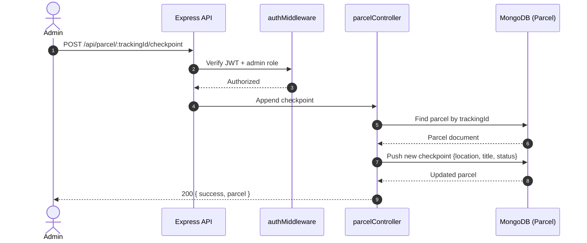

</details>

---

## 🚦 Parcel checkpoint state machine

A parcel's status progresses through a well-defined lifecycle, tracked as an append-only checkpoint history.

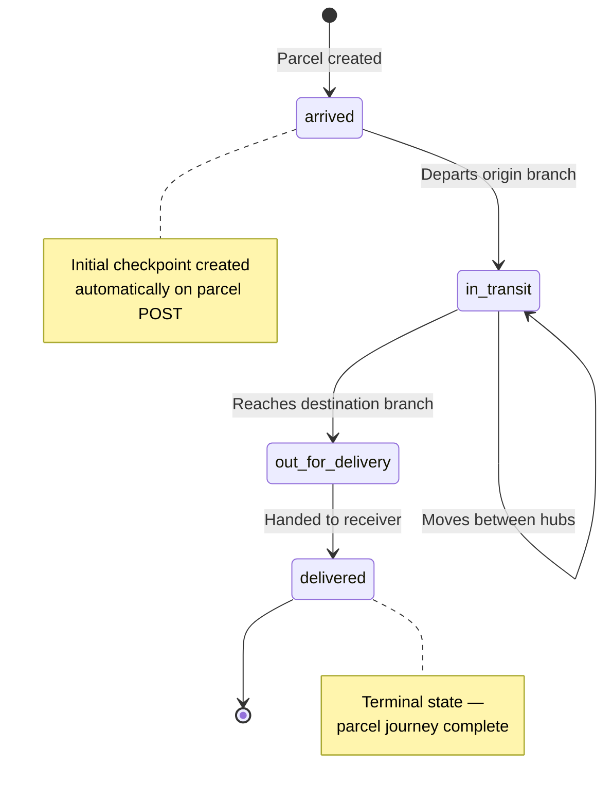

---

## 🗺️ Feature map

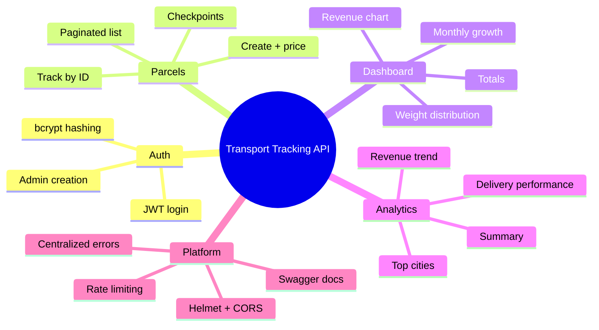

---

## ⚙️ Prerequisites

| Requirement | Version | Notes |
|---|---|---|
| 🟢 Node.js | 18+ (20 LTS recommended) | Runtime |
| 📦 npm | 9+ | Package manager |
| 🍃 MongoDB | Local instance or Atlas | Primary datastore |
| 🌳 Git | Latest stable | For cloning the repo |

---

## 🚀 Getting started

### 1. Clone the repository

```bash
git clone https://github.com/paras160500/Transport-Tracking-Backend-App-NodeJS.git
cd Transport-Tracking-Backend-App-NodeJS/backend
```

### 2. Install dependencies

```bash
npm install
```

### 3. Create the environment file

```bash
touch .env
```

Populate it using the [Environment variables](#-environment-variables) table below. **Never commit this file** — it's already covered by `.gitignore`.

### 4. Start the server

```bash
# Development, with automatic restarts
npm run dev

# Standard start
npm start
```

The API becomes available at `http://localhost:5000` when `PORT=5000`.

### 5. Verify the service

```bash
curl http://localhost:5000/health
```

```json
{
  "status": true,
  "message": "Working Perfectly."
}
```

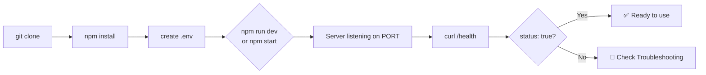

---

## 🔑 Environment variables

| Variable | Required | Description | Example |
|---|---|---|---|
| `PORT` | ✅ | Port used by the HTTP server | `5000` |
| `MONGO_URI` | ✅ | MongoDB connection URI | `mongodb://127.0.0.1:27017` |
| `JWT_SECRET` | ✅ | Long, random secret used to sign JWTs | `replace-with-a-long-random-secret` |
| `JWT_EXPIRE` | ✅ | JWT lifetime accepted by `jsonwebtoken` | `7d` |
| `COOKIE_EXPIRE` | ✅ | Cookie lifetime in days | `7` |
| `ADMIN_NAME` | For seeding | Initial administrator name | `System Administrator` |
| `ADMIN_EMAIL` | For seeding | Initial administrator email | `admin@example.com` |
| `ADMIN_PASSWORD` | For seeding | Initial administrator password | `change-this-password` |

<details>
<summary><strong>📄 Example <code>.env</code> file</strong></summary>

```env
PORT=5000
MONGO_URI=mongodb://127.0.0.1:27017
JWT_SECRET=replace-this-with-a-long-random-value
JWT_EXPIRE=7d
COOKIE_EXPIRE=7

ADMIN_NAME=System Administrator
ADMIN_EMAIL=admin@example.com
ADMIN_PASSWORD=change-this-immediately
```

</details>

> ℹ️ The database connection selects the `courier-delivery-app` database via Mongoose's `dbName` option — even when using MongoDB Atlas, `MONGO_URI` should contain the Atlas connection string and this database name will still be applied.

---

## ▶️ Running the API

| Command | Purpose |
|---|---|
| `npm install` | Install dependencies |
| `npm run dev` | Start with Nodemon (auto-restart) |
| `npm start` | Start with Node.js |
| `node seedAdmin.js` | Seed the first admin account |

> 🚨 The seed script is intentionally separate from normal startup — run it only **after** environment variables and the MongoDB connection are configured.

---

## 🌐 API overview

Default local base URL:

```
http://localhost:5000
```

| Area | Base path | Access |
|---|---|---|
| ❤️ Health check | `/health` | Public |
| 🔐 Authentication | `/api/auth` | Login public · user creation admin-only |
| 📦 Parcels | `/api/parcel` | Tracking & cost calc public · management admin-only |
| 📊 Dashboard | `/api/dashboard` | Admin-only |
| 📈 Analytics | `/api/analytics` | Admin-only |
| 📚 Swagger UI | `/api/docs` | Public |

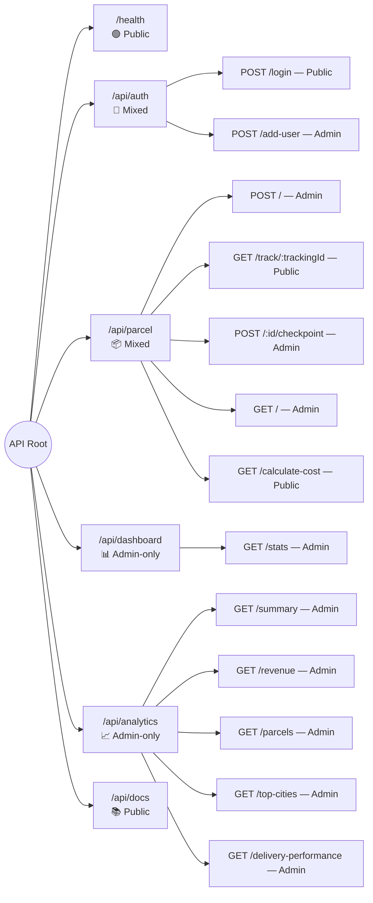

Interactive API documentation is available at [`http://localhost:5000/api/docs`](http://localhost:5000/api/docs) after the server starts.

---

## 🔐 Authentication

The API uses **bearer JWT authentication** for protected endpoints, with an additional `admin` role check on all management and analytics routes.

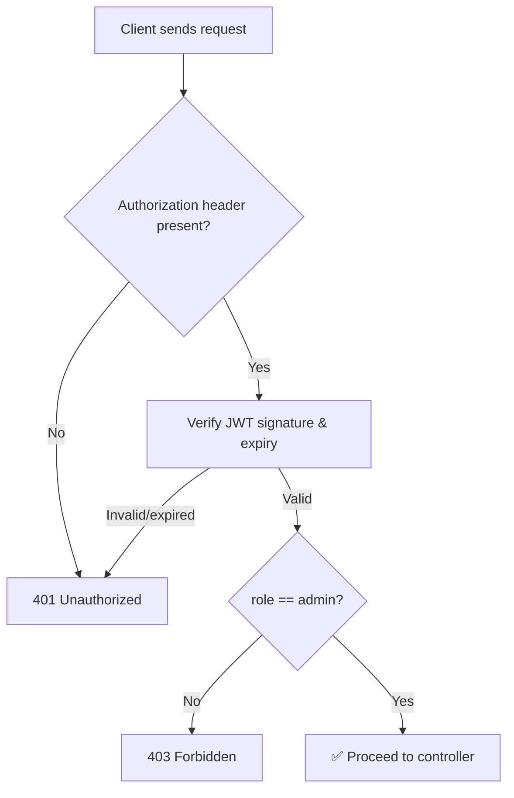

1. Send credentials to `POST /api/auth/login`.
2. Copy the `token` from the response.
3. Send it in the `Authorization` header for protected requests:

```
Authorization: Bearer <your-jwt-token>
```

> The current user model only permits the `admin` role — there is no separate non-admin user tier yet.

### Login example

```bash
curl -X POST http://localhost:5000/api/auth/login \
  -H "Content-Type: application/json" \
  -d '{
    "email": "admin@example.com",
    "password": "change-this-password"
  }'
```

Example response shape:

```json
{
  "success": true,
  "token": "<jwt-token>",
  "user": {
    "id": "<user-id>",
    "name": "System Administrator",
    "email": "admin@example.com",
    "role": "admin"
  }
}
```

---

## 📡 API reference

### ❤️ Health

| Method | Endpoint | Description | Auth |
|---|---|---|---|
| `GET` | `/health` | Confirms that the service is running | Public |

### 🔐 Authentication

| Method | Endpoint | Description | Auth |
|---|---|---|---|
| `POST` | `/api/auth/login` | Authenticates an administrator and returns a JWT | Public |
| `POST` | `/api/auth/add-user` | Creates another administrator account | Admin |

`POST /api/auth/add-user` body:

```json
{
  "name": "Operations User",
  "email": "operations@example.com",
  "password": "strong-password"
}
```

### 📦 Parcels

| Method | Endpoint | Description | Auth |
|---|---|---|---|
| `POST` | `/api/parcel` | Creates a parcel, calculates price, generates tracking ID, adds initial checkpoint | Admin |
| `GET` | `/api/parcel/track/:trackingId` | Retrieves a parcel and its checkpoint history | Public |
| `POST` | `/api/parcel/:id/checkpoint` | Adds a checkpoint (`:id` is the tracking ID) | Admin |
| `GET` | `/api/parcel` | Returns a paginated parcel list | Admin |
| `GET` | `/api/parcel/calculate-cost` | Calculates a delivery price without creating a parcel | Public |

<details>
<summary><strong>📥 <code>POST /api/parcel</code> request body</strong></summary>

```json
{
  "senderName": "Aarav Shah",
  "senderPhone": "9876543210",
  "senderAddress": "12 MG Road, Ahmedabad",
  "receiverName": "Priya Patel",
  "receiverPhone": "9876501234",
  "receiverAddress": "44 Park Street, Mumbai",
  "shipmentType": "national",
  "originCity": "Ahmedabad",
  "destinationCity": "Mumbai",
  "deliveryType": "standard",
  "parcelCategory": "documents",
  "weight": 0.5
}
```

</details>

<details>
<summary><strong>📤 Example response</strong></summary>

```json
{
  "success": true,
  "parcel": {
    "trackingId": "IND-CRR-123456789",
    "price": 250,
    "shipmentType": "national",
    "originCity": "Ahmedabad",
    "destinationCity": "Mumbai",
    "checkpoints": [
      {
        "location": "Ahmedabad",
        "title": "Parcel arrived at Ahmedabad Branch",
        "status": "arrived",
        "updatedBy": "System Administrator"
      }
    ]
  }
}
```

</details>

<details>
<summary><strong>📥 Add a checkpoint — <code>POST /api/parcel/:trackingId/checkpoint</code></strong></summary>

```json
{
  "location": "Mumbai Central Hub",
  "title": "Parcel in transit",
  "description": "The parcel is moving to the destination branch.",
  "status": "in_transit"
}
```

</details>

**Parcel list query parameters:**

| Parameter | Default | Description |
|---|---|---|
| `page` | `1` | Page number |
| `limit` | `10` | Records per page |
| `status` | Not set | Filters by the latest checkpoint status |
| `search` | Not set | Case-insensitive tracking-ID search |

```bash
curl "http://localhost:5000/api/parcel?page=1&limit=10&status=in_transit&search=IND-CRR" \
  -H "Authorization: Bearer <your-jwt-token>"
```

**Cost calculator payload** (same shipment fields used for pricing):

```json
{
  "shipmentType": "international",
  "originCity": "Ahmedabad",
  "destinationCity": "London",
  "parcelCategory": "electronics",
  "weight": 1.5,
  "deliveryType": "standard"
}
```

> ℹ️ The current route is implemented as `GET /api/parcel/calculate-cost`, while its input is validated from the request body. Clients should send a JSON body with this request. This may become a `POST` endpoint in a future revision for more conventional API design.

### 📊 Dashboard

| Method | Endpoint | Description | Auth |
|---|---|---|---|
| `GET` | `/api/dashboard/stats` | Returns dashboard totals and chart-ready data | Admin |

The dashboard response contains totals, monthly parcels, monthly revenue, status distribution, user growth, and weight distribution.

### 📈 Analytics

| Method | Endpoint | Query parameters | Description | Auth |
|---|---|---|---|---|
| `GET` | `/api/analytics/summary` | None | Totals, status distribution, and cities served | Admin |
| `GET` | `/api/analytics/revenue` | None | Monthly revenue for the last 12 months | Admin |
| `GET` | `/api/analytics/parcels` | None | Monthly parcel growth for the last 12 months | Admin |
| `GET` | `/api/analytics/top-cities` | `limit` (max 20) | Destination cities ranked by parcel count | Admin |
| `GET` | `/api/analytics/delivery-performance` | None | Monthly delivered-vs-delayed performance | Admin |

---

## 🗃️ Data models

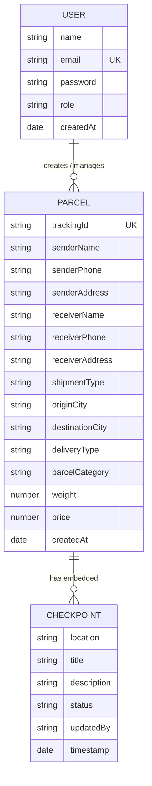

### User

| Field | Type | Notes |
|---|---|---|
| `name` | String | Required and trimmed |
| `email` | String | Required, unique, lowercase, and trimmed |
| `password` | String | Required; hashed before storage |
| `role` | String | Currently restricted to `admin` |
| `createdAt` | Date | Automatically generated |

### Parcel

| Field | Type | Notes |
|---|---|---|
| `trackingId` | String | Required, unique, and indexed |
| `senderName`, `receiverName` | String | Required |
| `senderPhone`, `receiverPhone` | String | Required |
| `senderAddress`, `receiverAddress` | String | Required |
| `shipmentType` | String | `national` or `international` |
| `originCity`, `destinationCity` | String | Required |
| `deliveryType` | String | `standard`, `overnight`, or `sameDay` |
| `parcelCategory` | String | See supported values below |
| `weight` | Number | Required; positive for validated requests |
| `price` | Number | Calculated by the pricing service |
| `checkpoints` | Array | Embedded delivery-status history |
| `createdAt` | Date | Automatically generated |

**Supported parcel categories:** `documents`, `electronics`, `clothing`, `food`, `medicine`, `cosematics`, `books`, `small_package`, `large_package`, `perishables`, `other`

**Checkpoint statuses:** `arrived`, `in_transit`, `out_for_delivery`, `delivered`

---

## 💰 Pricing rules

Pricing logic lives in `backend/services/calculatecost.js` and branches by shipment type.

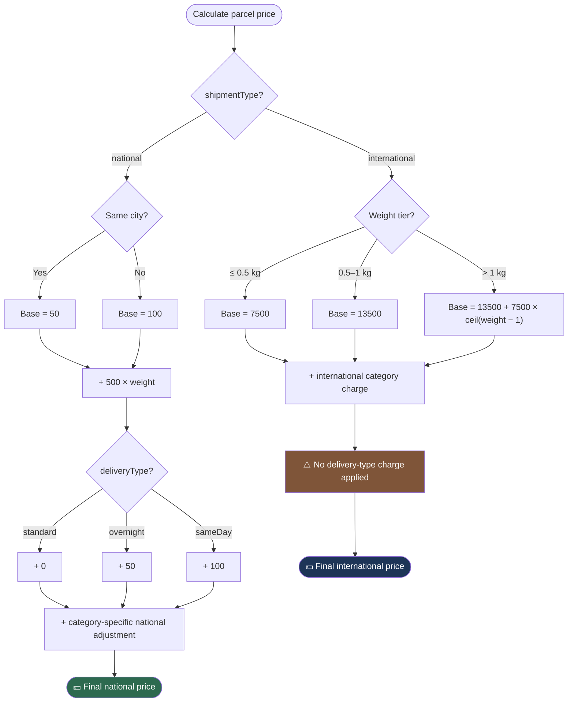

> ⚠️ **Note:** Pricing values are application constants, not external carrier rates. Review and calibrate them before using this service in a production billing workflow.

---

## 📂 Project structure

```
Transport-Tracking-Backend-App-NodeJS/
├── backend/
│   ├── app.js                         # Express application and middleware
│   ├── server.js                      # Database connection and HTTP startup
│   ├── seedAdmin.js                   # Initial admin account seeder
│   ├── package.json                   # Scripts and dependencies
│   ├── config/
│   │   ├── db.js                      # MongoDB connection
│   │   └── swagger.js                 # OpenAPI/Swagger configuration
│   ├── controllers/
│   │   ├── analysitcController.js     # Analytics handlers
│   │   ├── authController.js          # Login and admin creation
│   │   ├── dashboardController.js     # Dashboard statistics
│   │   └── parcelController.js        # Parcel operations
│   ├── middlewares/
│   │   ├── authMiddleware.js          # JWT and admin checks
│   │   ├── errorHandler.js            # 404 and error responses
│   │   └── rateLimiter.js              # Request throttling
│   ├── models/
│   │   ├── Parcel.js                   # Parcel and checkpoint schemas
│   │   └── User.js                     # User schema and password hashing
│   ├── routes/                         # API route modules
│   ├── services/
│   │   ├── analyticsServices.js       # Aggregation and chart data
│   │   ├── calculatecost.js            # Delivery-price calculation
│   │   └── generateTrackingId.js       # Tracking-ID generation
│   └── validations/
│       └── validations.js              # Joi request schemas
└── README.md
```

---

## 🛡️ Security and operational behavior

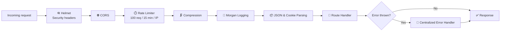

- 🔒 Passwords are hashed with `bcryptjs` before they are stored.
- 🎫 Protected requests require a valid JWT in a bearer authorization header.
- 👮 Administrative operations require the `admin` role.
- 🪖 Helmet adds common HTTP security headers.
- 🌐 CORS is enabled through the default Express CORS configuration.
- 🗜️ Compression is enabled for responses.
- 📝 Morgan logs requests using the `dev` format.
- ⏱️ A global rate limiter allows up to **100 requests per IP per 15-minute window**.
- 🔐 Authentication routes use a separate rate limiter with the same current limit.
- 🚫 Do not expose `.env`, JWT secrets, or administrator credentials in source control or logs.
- 🔁 Replace the sample administrator password before using the service outside local development.

---

## 🧯 Troubleshooting

<details>
<summary><strong>MongoDB connection fails</strong></summary>

Confirm that MongoDB is running, `MONGO_URI` is correct, and the database host allows connections from the machine running the API. For MongoDB Atlas, verify the IP access list and database user permissions.

</details>

<details>
<summary><strong>Protected endpoint returns <code>401</code></strong></summary>

Log in first and send the returned token as `Authorization: Bearer <token>`. Confirm that `JWT_SECRET` is identical when the token is issued and when the protected request is verified.

</details>

<details>
<summary><strong>Protected endpoint returns <code>403</code></strong></summary>

The authenticated account must have the `admin` role. The current schema only supports administrator accounts.

</details>

<details>
<summary><strong>Swagger UI does not show every operation</strong></summary>

Open `/api/docs` after starting the server. Swagger generation scans route files. If route documentation is expanded later, keep the OpenAPI annotations close to the route definitions and verify the configured scan path.

</details>

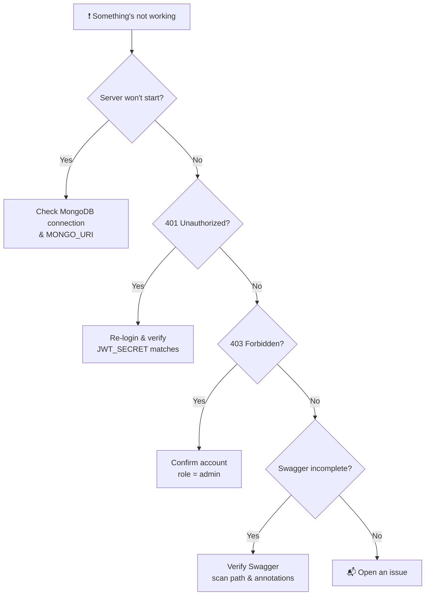

---

## 🤝 Contributing

1. Fork the repository.
2. Create a focused branch for your change.
3. Keep secrets and local configuration out of commits.
4. Update the README when endpoints, environment variables, or scripts change.
5. Test health, authentication, parcel, and analytics flows against a local MongoDB instance.
6. Open a pull request with a concise description of the change and its validation steps.

---

## 📄 License

No license is currently declared in the repository. Add a license file before distributing or reusing this project under defined permissions.

---

## 📚 References

- [Transport Tracking Backend App NodeJS][1] — repository
- [Node.js][2] — documentation
- [Express][3] — documentation
- [Mongoose][4] — documentation
- [OpenAPI Specification][5]

[1]: https://github.com/paras160500/Transport-Tracking-Backend-App-NodeJS "Transport Tracking Backend App NodeJS repository"
[2]: https://nodejs.org/ "Node.js documentation"
[3]: https://expressjs.com/ "Express documentation"
[4]: https://mongoosejs.com/ "Mongoose documentation"
[5]: https://swagger.io/specification/ "OpenAPI Specification"

---

<div align="center">

Built with 📦 for reliable parcel tracking

</div>
